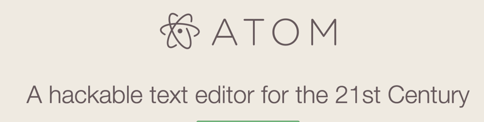

# 시작하기

## 에디터



* [Atom](https://atom.io/)
* javascript로 만들어진 (node.js)
* [Packages](https://atom.io/packages)
	* [Emmet](https://atom.io/packages/emmet)


## git

* https://github.com
* [todos 따라하기](https://github.com/niceaji/frontend-todos)
* [window client 설치](https://windows.github.com/)
* 레파지토리 만들기
* git commit 
* publish - git push 


## Node.js


* Chrome's JavaScript runtime
* backend 플랫폼
* `npm install serve -g`  웹서버 설치
	* [serve](https://github.com/tj/serve)

##​  javascript 


### 변수 

```
var language = 'javascript'; 
```

### DOM 접근

```
document.getElementById(id)
```


### 이벤트 등록

* [target.addEventListener](https://developer.mozilla.org/en-US/docs/Web/API/EventTarget/addEventListener)

```
todoStringField.addEventListener('keyup' , handler);
```

### [console.log](https://developer.mozilla.org/en-US/docs/Web/API/Console/log)

```
console.log("debug:", language);
```

## 함수 

```
function getDom(id){
    return document.getElementById(id);
}
```

##​ 이벤트 객체

*​ https://developer.mozilla.org/ko/docs/Web/API/Event
```
event.keyCode
```